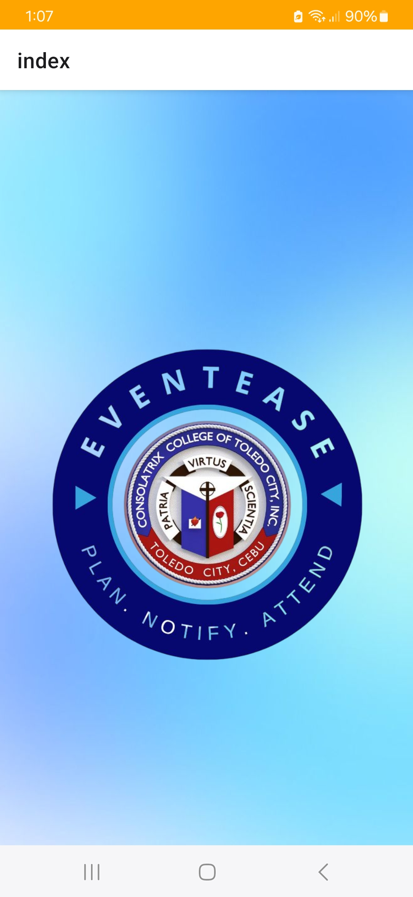
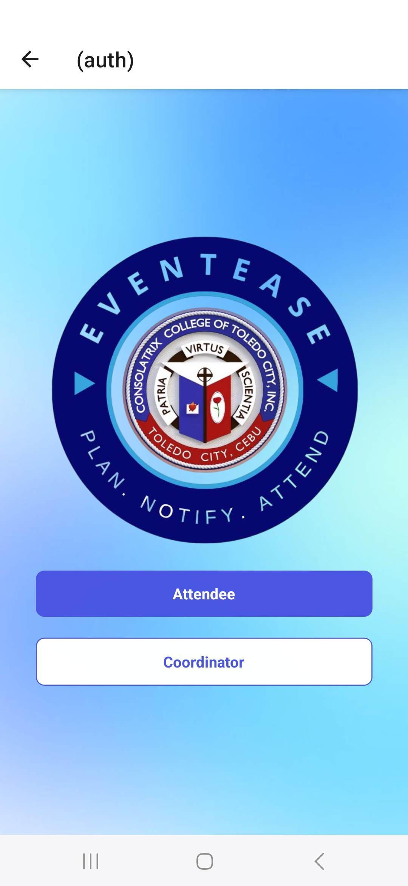
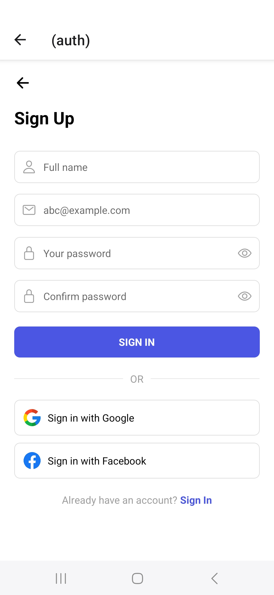
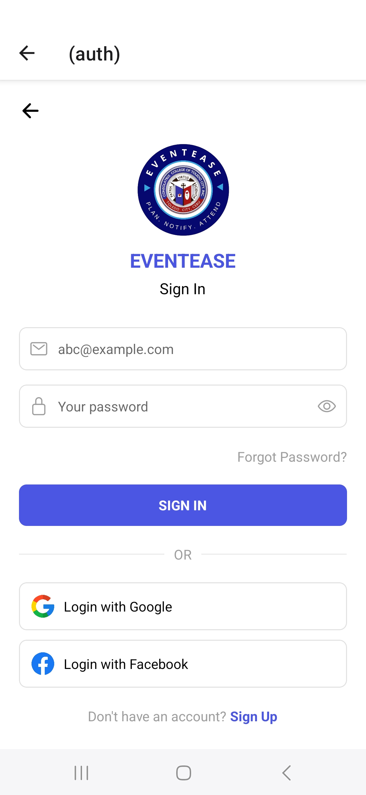
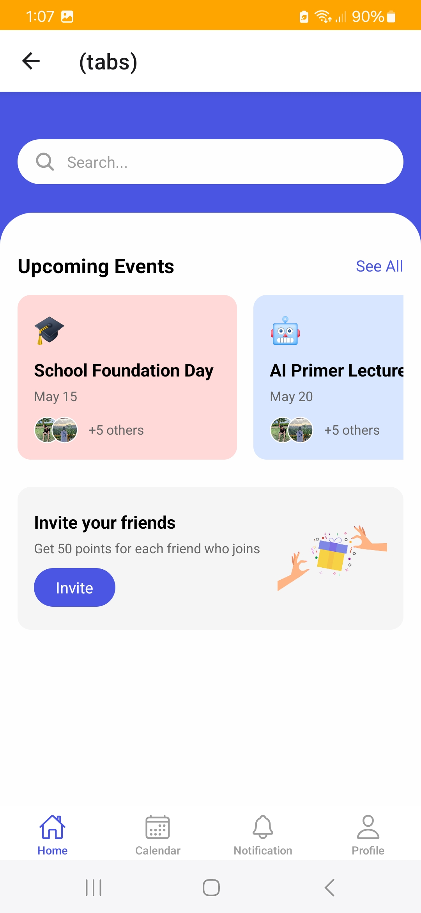
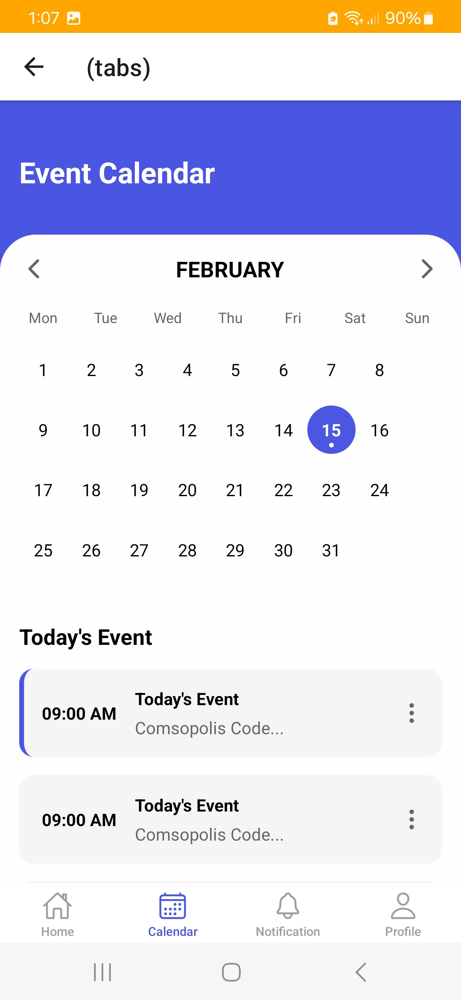
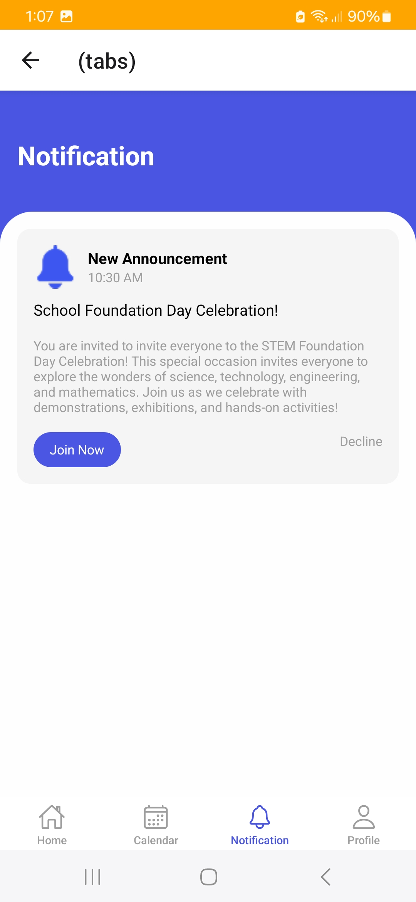
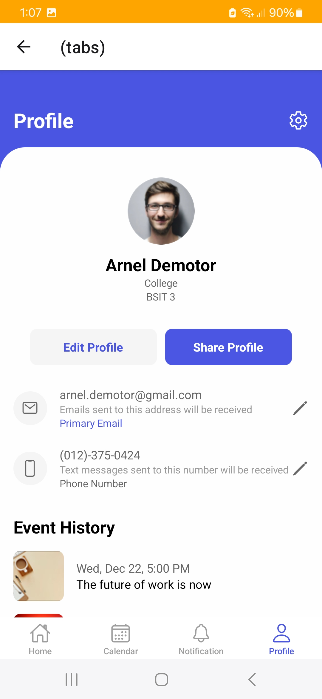

# EventEase
EventEase Mobile App.

# Features
* Real-Time Updates & Notifications
* Interactive Scheduling
* Seamless User Management
  
# Course Overview
* Event Booking System Development
* Real-Time Notifications & Updates
* User Registration & Authentication
* Event Tracking & Management
* Deployment and Scaling
  
# Tech Stack
* React Native
* AppWrite
* HTML, CSS and JS

# Onboarding Screen
  

# Role Selection Screen
 

# Sign Up Screen
  

# Sign In Screen
  

# Tabs Screen
   
   
   
   

# Screen  Demo
https://www.youtube.com/watch?v=_i2bWz62oKk
